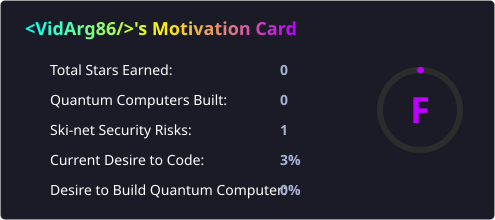
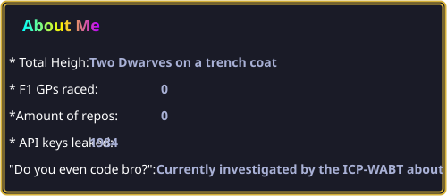

## Hee Ho!, I'm Programmer, I think, people tell me that I am
         
"I could actually TRY to make a quantum computer, that is if I felt like it, but I'm not CATCHing the desire to do so atm"

Disclaimer: This statement has not been verified by the International Committee of People Who Actually Build Things.

## About Me

People say I'm an overachiever.....I just learned windows doesn't fully turn off whith the PC...next time I pass a Home Depot I'm buying a hammer just in case I see the decepticon Emblem on this god forsaken machine
[.](./ICP-WABTReportOnZED-36.pdf)
##
:wq
<!--
**VidArg86/VidArg86** is a ✨ _special_ ✨ repository because its `README.md` (this file) appears on your GitHub profile.

Here are some ideas to get you started:

- 🔭 I’m currently working on ...
- 🌱 I’m currently learning ...
- 👯 I’m looking to collaborate on ...
- 🤔 I’m looking for help with ...
- 💬 Ask me about ...
- 📫 How to reach me: ...
- 😄 Pronouns: ...
- ⚡ Fun fact: ...
-->
